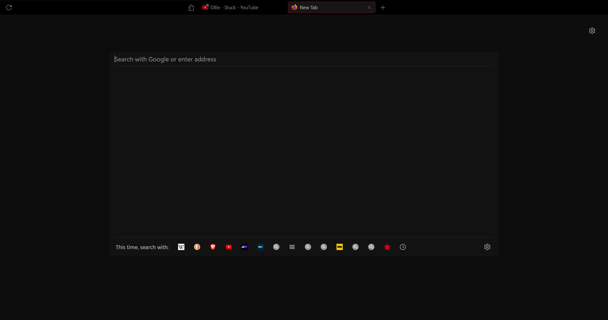

# Firefox-minimal.css

Minimalistic firefox userChrome.css. Focus on keyboard shortcuts.

## Changes
Forgot most of them, what make the difference from other
 - Hide some context menu item
 - Hide Tab cross icon, shows when hover the tab
 - Now playing media icon adjust, shows along favicon
 - Floating navbar in center

> Code is badly formated 

 ## Installing
Firstly enable the option `toolkit.legacyUserProfileCustomizations.stylesheets` from your `about:config` or `user.js` file.
- Then open your profile folder (you can find the location in `about:profiles` root directory).
- Create the folder chrome inside of it, and place the `userChrome.css` file inside.
- This should work with any theme and density in Firefox.(didn't tested fully)
- It meant for `compact density` (enbale `browser.compactmode.show` in `about:config`)

## Keyboard Shortcuts
Shortcuts for general use
- New Tab = ` ctrl + t `
- Close Tab = ` ctrl + w `
- Open tab in new window = ` ctrl + n `
- Open last close tab = ` ctrl + shift + t `
- Close all tab = ` ctrl + shift + w `
- Focus on address bar = ` ctrl + l `
- Cycle tabs = ` ctrl + tab ` (setting< general < tab)

 Extra keyboard shorcuts

- Open menu bar  = ` alt `
- Bookmark sidepanel = ` ctrl + b `
- Bookmark Library = ` ctrl + shift + o `
- Show / Hide bookmark bar = ` ctrl + shift + b `
- History sidepanel = ` ctrl + h `
- Donwloads = ` ctlr + j `
- Find in page = ` ctrl + f `
- Open defautl search open = ` ctrl + e `
- about:addons = ` ctrl + shift + a `

## Credits
Based off [userChrome.css](https://github.com/ericmurphyxyz/userChrome.css) and [FirefoxCSS-Darknight](https://github.com/BriLHR/FirefoxCSS-Darknight)
