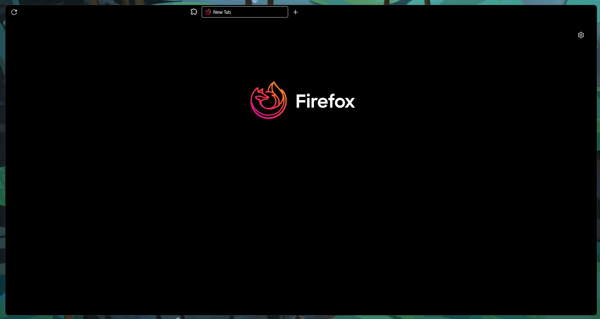
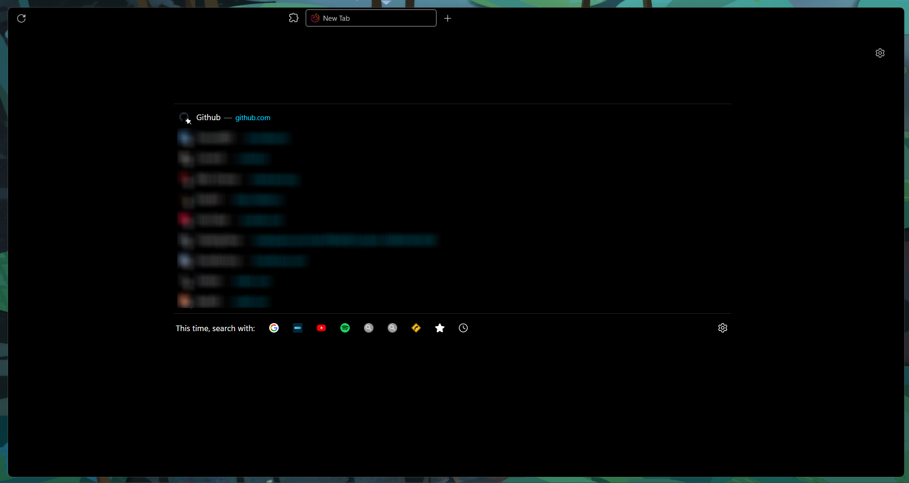
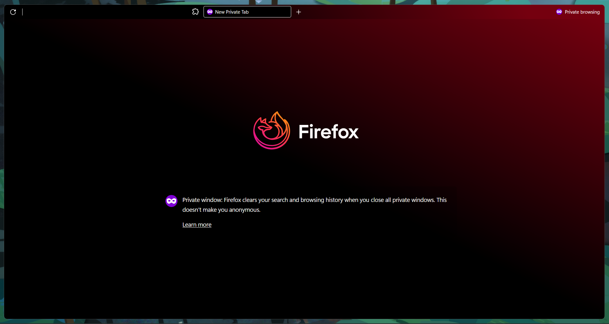

  <h3>General View</h3>
  

  <h3>Floating Navigation</h3>
  

  <h3>Audio Icon</h3>
  
  
  <h3>Private Mode</h3>
  

# Firefox-minimal.css

Minimalistic ***oneliner*** firefox userChrome.css. Focus on keyboard shortcuts.

## Changes
Forgot most of them, what make the difference from other
 - Hide some context menu item
 - Hide Tab cross icon, shows when hover the tab
 - Now playing audio icon adjust, shows along favicon
 - Floating navbar in center
 - Icon change
 - Hide most of the unnecessary items
 - Many more don't remember

 ## Installing
Firstly enable the option `toolkit.legacyUserProfileCustomizations.stylesheets` to `true` from your `about:config` or `user.js` file.
- Then open your profile folder (you can find the location in `about:profiles` root directory).
- Copy `chrome` folder to that root directory.
- This should work with any theme and density in Firefox.
- It meant for `compact density` (enbale `browser.compactmode.show` to `true` in `about:config`)

## Keyboard Shortcuts
Shortcuts for general use
- New Tab = ` ctrl + T `
- Close Tab = ` ctrl + W `
- Open tab in new window = ` ctrl + N `
- Open last close tab = ` ctrl + shift + T `
- Close all tab = ` ctrl + shift + W `
- Focus on address bar = ` ctrl + L `
- Cycle tabs = ` ctrl + tab ` (setting< general < tab)

 <h3>Extra keyboard shorcuts</h3>
 

- Show menu bar  = ` alt `
- Bookmark sidepanel = ` ctrl + B `
- Bookmark Library = ` ctrl + shift + O `
- Show / Hide bookmark bar = ` ctrl + shift + B `
- History sidepanel = ` ctrl + H `
- Donwloads = ` ctlr + J `
- Find in page = ` ctrl + F `
- Find next word = ` ctrl + G `
- Open defautl search open = ` ctrl + E `
- about:addons = ` ctrl + shift + A `

## Credits
Based off [userChrome.css](https://github.com/ericmurphyxyz/userChrome.css) and [FirefoxCSS-Darknight](https://github.com/BriLHR/FirefoxCSS-Darknight)
